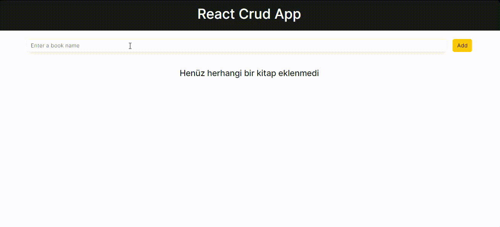

# Book Management App

A simple React application for managing your book collection. Add, delete, edit, and mark books as read with ease.

## Table of Contents

- [Overview](#overview)
- [Features](#features)
- [Libraries](#libraries)
- [Getting Started](#getting-started)
- [Usage](#usage)
- [Gif](#gif)


## Overview

This React application serves as a book management system, allowing users to keep track of their book collection. The app provides a user-friendly interface for adding new books, marking books as read or unread, editing book details, and deleting books from the collection.

## Features

- **Add New Books:** Enter a book name and timestamp to add a new book to your collection.

- **Mark as Read/Unread:** Click on a book card to toggle between marking it as read or unread.

- **Edit Book Details:** Modify book details such as the title, date, and read status.

- **Delete Books:** Remove books from your collection with the click of a button.

## Libraries

The following libraries are used in this project:

- **React:** A JavaScript library for building user interfaces.
- **React Toastify:** A library for displaying toast notifications in React applications.
- **UUID:** A library for generating unique identifiers.
- **React Router:** A library for navigation in React applications.
- **Bootstrap:** A popular front-end framework for building responsive and stylish web pages.

## Getting Started

Follow these steps to set up the project on your local machine:

1. **Clone the Repository:**

    ```bash
    git clone https://github.com/your-username/book-management-app.git
    ```

2. **Install Dependencies:**

    ```bash
    cd book-management-app
    npm install
    ```

3. **Run the Development Server:**

    ```bash
    npm start
    ```

4. **Open in Browser:**

    Open [http://localhost:3000](http://localhost:3000) in your web browser to access the application.

## Usage

1. **Add New Book:**
   - Enter a book name in the input field.
   - Click the "Add" button to add the book to your collection.

2. **Mark as Read/Unread:**
   - Click on a book card to toggle between marking it as read or unread.

3. **Edit Book Details:**
   - Click the "Edit" button on a book card.
   - Modify the book details as needed.
   - Click "Save" to update the book details.

4. **Delete Book:**
   - Click the "Delete" button on a book card to remove it from your collection.

## Gif



